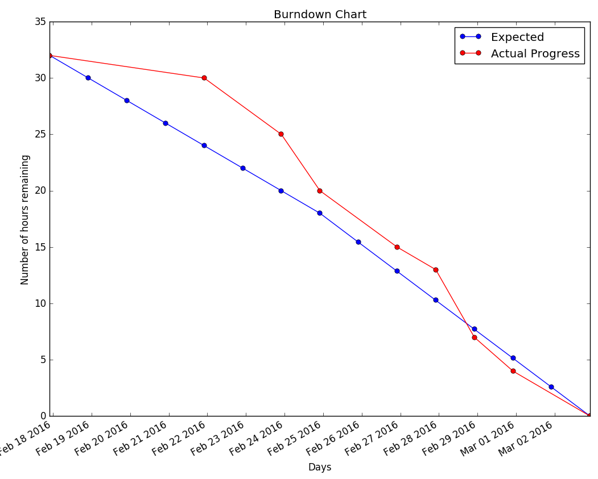

### Initial Planning - 17 February

- Scrum master chosen: Angel
  - Role: Take meeting minutes, check in on all open tasks at meetings to ensure that 
    everything is given discussion and any issues are addressed promptly
- Set up basic ideas behind implementation (via GitHub issues)
  - Tasks classified as **small** (<2 hours), **medium**(~4 hours), or **large**(~8 hours) based on
    groups current understanding level and experience (i.e. how long do you think this would take?)
  - Chose subset of issues, with goal of completing them by Wednesday, Feb. 24. Since our extension intends
    to follow the MVC design pattern, we attempted to choose issues across all three domains so as to get a 
    workable product. Issues are stored under the milestone Phase 2

### Sprint Backlog

The goal for the first week was to get a basic level of functionality in UI and the back-end. Towards 
this goal, we aimed for the general UI elements (in-window displays and extension control pages) and 
background information gathering (cookie data and OS information).

- Tasks for week 1 (17 Feb. -> 24 Feb):
  - [#4](https://github.com/csc301-winter-2016/project-team5/issues/4) Track when cookies are sent to 
    third-party servers. (**Medium**)
    - Assigned: Angel, Doga
    - Completed: [23 Feb](https://github.com/csc301-winter-2016/project-team5/pull/18)
  - [#5](https://github.com/csc301-winter-2016/project-team5/issues/5) Showing the OS information sent in 
    with HTTP requests. (**Small**)
    - Assigned: Allan, Albert
    - Completed: 27 Feb
  - [#11](https://github.com/csc301-winter-2016/project-team5/issues/11) UI - Within page presentation of 
    information (**Medium**)
    - Assigned: Marc, Adam
    - Completed: 24 Feb
  - [#12](https://github.com/csc301-winter-2016/project-team5/issues/12) UI - Settings page (**Small**)
    - Assigned: Adam, Doga
    - Completed: 22 Feb

*Total expected hours for week 1: 12-14*

The second week focussed more on getting information to the back-end and displaying it in a meaningful way. As
a result, the majority of the work was on UI elements and a message-passing function. 

- Tasks for week 2 (24 Feb -> 2 Mar)
  - [#3](https://github.com/csc301-winter-2016/project-team5/issues/3) Show the number of all cookies on the page
    (**Medium**)
    - Assigned: Adam
    - Completed: 26 Feb
  - [#26](https://github.com/csc301-winter-2016/project-team5/issues/26)Continue developing UI elements (**Medium**)
    - Assigned: Marc, Adam
    - Completed: 2 Mar
  - [#13](https://github.com/csc301-winter-2016/project-team5/issues/13)Implement Controller to relay information from backend to UI (**Large**)
    - Assigned: Adam, Albert
    - Completed:
  - Add message passing from backend cookies script to Controller (**Small**)
    - Assigned: Angel, Doga
    - Completed: 26 Feb
  - Work on deliverables (**Medium**)
    - Assigned: Allan
    - Completed: 2 Mar

*Total expected hours for week 2: 18*

---

### Update meetings

- Initial Meeting: 17 Feb. All present. See above for details.
- Meeting: 22 Feb. All present.
  - Angel: Cookie information gathering in decent state; currently logs information to console.
  - Marc: Implemented generic sliding banner that appears when a webpage is finished loading. Ready to display data.
  - Allan/Albert: Working towards getting OS information; still getting comfortable with Javascript.
  - Doga/Adam: Implemented control UI, but buttons still do nothing. Need to look into storing/looking up this data.
  - Doga to join Angel on Issue [#4](Track when cookies are sent to third-party servers.).
- Meeting: 24 Feb. Allan could not attend (midterm)
  - *Meeting with TA.*
  - Marc: Continuing to refine UI.
    - Need to think about effective way to present information (perhaps a 
      [progressive system](https://github.com/csc301-winter-2016/project-team5/issues/16)?)
    - Currently, information quantity can be overwhelming.
  - Adam: Working on implementing Controller to allow communication between back-end and UI.
    - We need to consider exactly which messages are going to be shown and how.
  - Albert: OS information almost done. Transferring to help Adam with controller.
  - Angel/Doga: Basic functionality of cookie tracking implemented, but with a few issues 
    (see [#14](https://github.com/csc301-winter-2016/project-team5/pull/23)).
- Meeting: 26 Feb. Allan could not attend (midterm)
  - *Short Check-in with TA.*
  - Angel/Adam/Doga: Working on coordinating between Controller and back-end.
  - Marc/Adam: Continuing to refine UI and integrate it with controller.
  - Albert: Working with Adam to implement messaging.
  - Allan: Will work on deliverables.

### Burndown Chart

### Review & Retrospective
- We met over the reading week break and assigned tasks.
- All tasks assigned for this phase were completed on time.
- Any task we labelled as "large" was not touched; we split up the remaining tasks informally.
- We learned that we had to write the code two different places to do one thing: Two way message passing - both view and controller has to communicate (to satisfy the chrome API requirements).
- Because of the nature of Scrum, we discussed any updates/issues on our tasks at the beginning of all group meetings.
- Decisions that worked well:
  - Estimated task size well, collaboration was good.
  - From phase 1, we identified, as a potential problem, that not everyone is familiar with Javascript. However, this did not appear to be much of an issue throughout this phase.
- Decisions/actions done that were not effective:
  - Not using pull requests properly (fusing own pull request). Someone else should look at the pull request.
  - Most of our source code requires more documentation. 
  - Use branches more effectively (i.e. deleting them when done).
- Suggestions for improvement moving forward:
  - Provide more meaningful documentation for all functions/scripts.
  - Do peer review of code so that another group member has a deeper and better understanding.
  - Better use of GitHub tools (i.e. pull requests).
