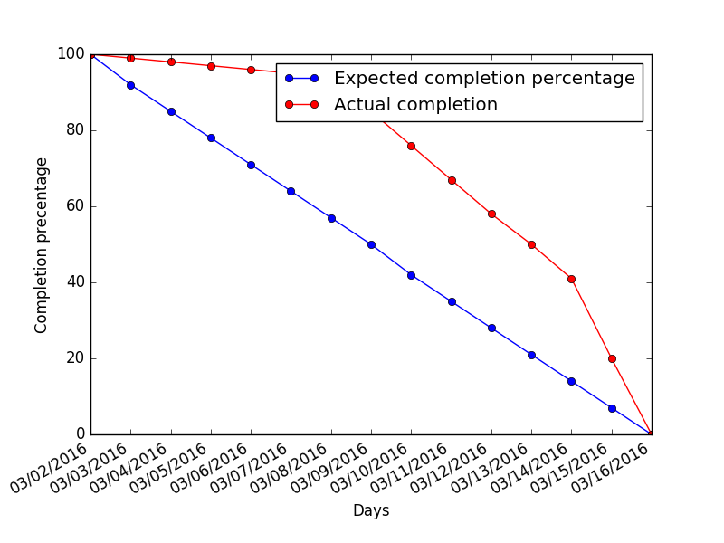

#Describing the process

Similar to the process adopted for the previous phases, we shared the work load and created issues and branches for each task that needed to be completed.
Each major component of the extension was worked on in different branches. The rationale for utilizing branches is that the scope of our extension is increasing and we need to draw lines between what is finished (master) and what needs to be worked on (branches not yet merged to master). It also allows the group members assigned to a task to work without immediately disrupting the master branch/other branches. When a task was completed, the person assigned to the job issued a pull-request. Group members who were NOT assigned to the task looked at the pull-request and decided to accept the proposed changes, or to ask the group members assigned to the task to change parts of the code as necessary. This allows for a code review that ensures that the assigned tasks were completed, with no complaints, and also allows the other members to get a deeper understanding of the code. After the pull-request was accepted, we tested our extension with the new features outlined in said pull-request. Once we saw that the task in question worked compatibly with the rest of the extension, we closed the issue associated with the completed task.

##How did we organize ourselves and which tools did we use?

In terms of programming languages, we utilized JavaScript (~90% of the code), HTML and CSS.
For this phase, we included additional Javascript libraries that were useful for creating charts and graphs.
The following libraries were added:  
[Chart.min.js] (../../src/main/extension/scripts/Chart.min.js),
[d3.min.js] (../../src/main/extension/scripts/ds.min.js),
[moment.min.js] (../../src/main/extension/scripts/moment.min.js),
as we had a new detailed idea to implement graphs based on third-party cookies tracking. 
Refer to following issue: [#29](https://github.com/csc301-winter-2016/project-team5/issues/29).

We used GitHub as our repository, Google Chrome itself to test our implementation, Slack to communicate and coordinate meetings and everyone used their own favorite editor(Vim, Sublime Text etc.).

##Meeting minutes or other record of re-planning events

"Scrum master" was Angel ever since scrum was implemented in phase 2. He opted to continue with this role.

- March 2  
Duration: 4 hours  
Presentation: Allan joined for the Phase 3 part.  
Summary: We finished Phase 2 and performed a demo to the TA. Afterwards, we did a retrospective review and fixed the bugs that showed up during the demo. Finally, we planned phase 3 and opened new issues for this phase. We shared the workload and everyone was assigned to one or more tasks.

- March 9  
Presentation: All present  
Duration: 4 hours  
Summary: We reviewed the work we have done after March 2nd. Albert and Doga cleaned the [lessons.js] (../../src/main/extension/scripts/controller/lessons.js)
code, Marc checked the pull requests made by Adam and reviewed/closed them. Adam and Allan worked on highlighting social media content from webpages.
Please refer to following page for source path [socialMediaHighlighter.js] (../../src/main/extension/scripts/views/socialMediaHighlighter.js). Angel continued working on [graphs and history table] (https://github.com/csc301-winter-2016/project-team5/issues/29).

	
- March 16  
Duration: 7 hours  
Presentation: All present  
Summary: Albert, Angel and Doga worked on stats_page, 
new files added to implement stats_page: 
[infopage.js] (../../src/main/extension/scripts/infopage/infopage.js),
[infopage.html](../../src/main/extension/infopage.html). Marc and Adam debugged [fingerprinting.js](../../src/main/extension/scripts/views/fingerprinting.js)
and merged a pull request and closed the related issue. Allan did the burndown chart for this file.

- FUTURE MEETING: March 23  
Duration: N/A  
Presentation: Expecting all present  
Summary: Proposed date set up to meet with TA for demo.  

##Burndown charts, diagrams, issues searches on GitHub and more

 
 On March 7th,  
[issue #31] (https://github.com/csc301-winter-2016/project-team5/issues/31) was completed.  
On March 14th, 
[issue #40] (https://github.com/csc301-winter-2016/project-team5/issues/40),  
[issue #30] (https://github.com/csc301-winter-2016/project-team5/issues/30),  
[issue #16] (https://github.com/csc301-winter-2016/project-team5/issues/16) were completed.  
On March 16th,  
[issue #29] (https://github.com/csc301-winter-2016/project-team5/issues/29)  
[issue #28] (https://github.com/csc301-winter-2016/project-team5/issues/28)  
[issue #9] (https://github.com/csc301-winter-2016/project-team5/issues/9)  
[issue #8] (https://github.com/csc301-winter-2016/project-team5/issues/8)   
